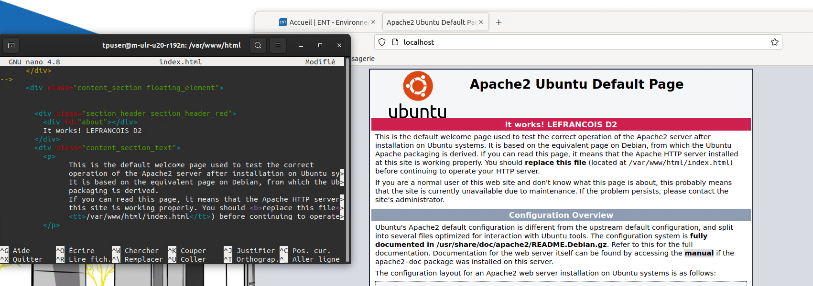
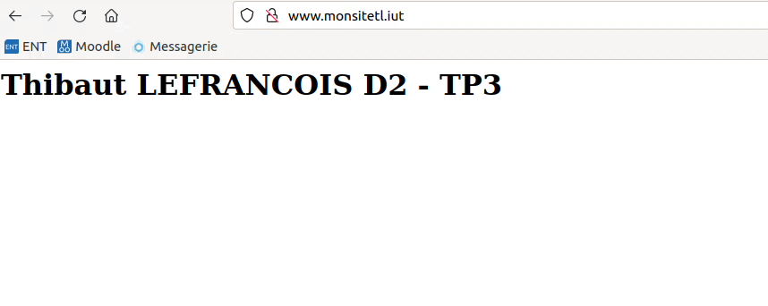

**Thibaut LEFRANCOIS D2 - 24/02/23**

> *Version d'Apache : 2.4.41-4ubuntu3.13*  
> *Adresse IP de la machine : 10.192.150.162*  
> *Nom de la machine : m-ulr-u20-r192n*  

## TP Réseaux : Configuration et utilisation d'un serveur Web  Apache

### Question 1 : 

Résultat de la commande dpkg -l apache2 :

```bash
Souhait=inconnU/Installé/suppRimé/Purgé/H=à garder
| État=Non/Installé/fichier-Config/dépaqUeté/échec-conFig/H=semi-installé/W=attend-traitement-déclenchements
|/ Err?=(aucune)/besoin Réinstallation (État,Err: majuscule=mauvais)
||/ Nom            Version            Architecture Description
+++-==============-==================-============-=================================
ii  apache2        2.4.41-4ubuntu3.13 amd64        Apache HTTP Server
```
Etat : `Installé`

Version bien installé d'Apache : ***2.4.41-4ubuntu3.13***

### Question 2 :

Pour vérifier qu'un serveur Web tourne sur votre machine on peut procédér de différentes façon. 

* Premièrement en se rendant sur Firefox en recherchant l'adresse `localhost/` qui nous redirigera sur une page de test Apache.  Cette page contient généralement des informations sur la version d'Apache installée et les options de configuration disponibles.
* Deuxièmement en utilisant la commande `sudo systemctl status apache2` qui nous renverra le statut du service Apache et dans notre cas nous retourne ceci : 

```bash
 apache2.service - The Apache HTTP Server
     Loaded: loaded (/lib/systemd/system/apache2.service; enabled; vendor preset: enabled)
     Active: active (running) since Tue 2023-02-21 14:45:42 CET; 23min ago
       Docs: https://httpd.apache.org/docs/2.4/
   Main PID: 9605 (apache2)
      Tasks: 55 (limit: 7037)
     Memory: 12.4M
     CGroup: /system.slice/apache2.service
             ├─9605 /usr/sbin/apache2 -k start
             ├─9606 /usr/sbin/apache2 -k start
             └─9607 /usr/sbin/apache2 -k start

févr. 21 14:45:42 m-ulr-u20-r192n systemd[1]: Starting The Apache HTTP Server...
févr. 21 14:45:42 m-ulr-u20-r192n apachectl[9604]: AH00558: apache2: Could not reliably determine the server's fully qualified domain name, using 127.0.1.1. Set the 'ServerName' directive globally to su>
févr. 21 14:45:42 m-ulr-u20-r192n systemd[1]: Started The Apache HTTP Server.
```
Etat du serveur : `Active: active (running)`	

### Question 3 :

La directive ***ServerRoot*** dans Apache permet de spécifier le répertoire racine du serveur web. C'est-à-dire, le répertoire dans lequel se trouvent les fichiers de configuration, les fichiers log, les fichiers de modules et les autres fichiers nécessaires au bon fonctionnement du serveur.

Pour retrouver la valeur par défaut de cette directive on peut utiliser la commande `grep -r ServerRoot /etc/apache2/*` qui nous retourne ceci :

```bash
/etc/apache2/apache2.conf:# ServerRoot: The top of the directory tree under which the server's
/etc/apache2/apache2.conf:#ServerRoot "/etc/apache2"
```

### Question 4 :

La directive ***ErrorLog*** dans Apache permet de spécifier l'emplacement du fichier de journalisation des erreurs du serveur web. Cela inclut les erreurs liées aux requêtes HTTP, aux erreurs de configuration et à d'autres erreurs rencontrées par le serveur.

Pour retrouver la valeur par défaut de cette directive on peut utiliser la commande `grep -r ErrorLog /etc/apache2/*` qui nous retourne ceci :

```bash
/etc/apache2/apache2.conf:# ErrorLog: The location of the error log file.
/etc/apache2/apache2.conf:# If you do not specify an ErrorLog directive within a <VirtualHost>
/etc/apache2/apache2.conf:ErrorLog ${APACHE_LOG_DIR}/error.log
```

La directive ErrorLog est donc définie dans le fichier `/etc/apache2/apache2.conf` et sa valeur par défaut est : `ErrorLog ${APACHE_LOG_DIR}/error.log`

On cherche donc maintenant la valeur de la variable d'environnement : APACHE_LOG_DIR. Pour cela on utilise la commande `grep -r APACHE_LOG_DIR /etc/apache2/*` et on y retrouve ce chemin : 
```bash	
/etc/apache2/envvars:export APACHE_LOG_DIR=/var/log/apache2$SUFFIX
```

La directive ErrorLog est donc définie dans le fichier `/var/log/apache2$SUFFIX/error.log`

Pour vérifier si le fichier de log existe on utilise la commande `ls /var/log/apache2$SUFFIX/error.log` et on constate alors par le résultat `/var/log/apache2/error.log` que le fichier de log existe bien. 

Cela semble logique car la variable d'environnement APACHE_LOG_DIR à été définit dans le fichier `/etc/apache2/envvars` et que ce fichier est appelé dans le fichier `/etc/apache2/apache2.conf`

### Question 5 :

La directive ***DocumentRoot*** dans Apache permet de spécifier le répertoire racine du site web par défaut, c'est-à-dire le répertoire dans lequel se trouvent les fichiers du site web.

La valeur de cette directive est définie dans le fichier `/etc/apache2/sites-enabled/000-default.conf` et on peut la retrouver en utilisant la commande `sudo nano /etc/apache2/sites-available/000-default.conf` qui nous retourne ceci :

```bash
ServerAdmin webmaster@localhost
DocumentRoot /var/www/html
```

Après avoir ajouté mon nom et mon groupe dans le fichier html à l'emplacement `/var/www/html/index.html` on peut voir que le site web est bien modifié en allant sur l'adresse `localhost` dans Firefox tel que : (au niveau du message "It works!")



### Question 6 :

La directive ***CustomLog*** dans Apache permet de définir l'emplacement et le format du fichier de journalisation des accès HTTP. Pour le site par défaut, cette directive pointe vers le fichier /var/log/apache2/access.log. 

Pour voir le contenu de ce fichier, on utilise la commande `sudo nano /var/log/apache2/
access.log` qui nous retourne ceci :
```bash
27.0.0.1 - - [22/Feb/2023:23:04:35 +0100] "GET / HTTP/1.1" 200 3477 "-" "Mozilla/5.0 (X11; Ubuntu; Linux x86_64; rv:105.0) Gecko/20100101 Firefox/105.0"
127.0.0.1 - - [22/Feb/2023:23:04:35 +0100] "GET /icons/ubuntu-logo.png HTTP/1.1" 200 3623 "http://localhost/" "Mozilla/5.0 (X11; Ubuntu; Linux x86_64; rv:105.0) Gecko/20100101 Firefox/105.0"
127.0.0.1 - - [22/Feb/2023:23:04:35 +0100] "GET /favicon.ico HTTP/1.1" 404 487 "http://localhost/" "Mozilla/5.0 (X11; Ubuntu; Linux x86_64; rv:105.0) Gecko/20100101 Firefox/105.0"
127.0.0.1 - - [22/Feb/2023:23:07:17 +0100] "GET / HTTP/1.1" 200 3491 "-" "Mozilla/5.0 (X11; Ubuntu; Linux x86_64; rv:105.0) Gecko/20100101 Firefox/105.0"

```

On retrouve donc bien le contenu du fichier de journalisation des accès HTTP qui enregistre toutes les requêtes HTTP reçues par le serveur web Apache.

### Question 7 :

La directive DirectoryIndex permet de spécifier une liste de noms de fichiers qui seront utilisés par le serveur web Apache comme page d'index lorsqu'aucun nom de fichier n'est spécifié dans l'URL.

Par défaut, la directive DirectoryIndex est définie dans le fichier de configuration du site dans le fichier `/etc/apache2/mods-available/dir.conf`.

Ensuite, pour recharger la configuration du serveur Apache et prendre en compte les modifications, on exécute la commande suivante: `sudo service reload apache2`	

### Question 8 :

Premièrement je copie le fichier 000-default.conf vers un nouveau fichier que je nommerais `monsiteTL.conf` :
```
cp 000-default.conf monsiteOJ.conf
```
Je recopie et remplace les bon champs dans le fichier que je viens de copier. Voici le fichier fini :
```html
<VirtualHost *:80>
        # The ServerName directive sets the request scheme, hostname and port that
        # the server uses to identify itself. This is used when creating
        # redirection URLs. In the context of virtual hosts, the ServerName
        # specifies what hostname must appear in the request's Host: header to
        # match this virtual host. For the default virtual host (this file) this
        # value is not decisive as it is used as a last resort host regardless.
        # However, you must set it for any further virtual host explicitly.
        #ServerName www.example.com

        ServerAdmin www.monsiteTL.iut
        DocumentRoot /home/tpuser/www

        # Available loglevels: trace8, ..., trace1, debug, info, notice, warn,
        # error, crit, alert, emerg.
        # It is also possible to configure the loglevel for particular
        # modules, e.g.
        #LogLevel info ssl:warn

        ErrorLog /home/tpuser/www/log/error.log
        CustomLog /home/tpuser/www/log/access.log combined

        <Directory /home/tpuser/www/>
                Options Indexes FollowSymLinks
                AllowOverride
                Order allow,deny
                Allow from all
                Require all granted
        </Directory>
        # For most configuration files from conf-available/, which are
        # enabled or disabled at a global level, it is possible to
        # include a line for only one particular virtual host. For example the
        # following line enables the CGI configuration for this host only
        # after it has been globally disabled with "a2disconf".
        #Include conf-available/serve-cgi-bin.conf
</VirtualHost>

# vim: syntax=apache ts=4 sw=4 sts=4 sr noet
```

### Question 9 :

Tout d'abord je cherche à activer mon site à l'aide des commandes `sudo systemctl reload apache2` puis `sudo a2ensite monsiteTL.conf` :

```bash
tpuser@m-ulr-u20-r192n:~/www$ sudo systemctl reload apache2
tpuser@m-ulr-u20-r192n:~/www$ sudo a2ensite monsiteTL.conf
Site monsiteTL already enabled
```

Je modifie la ligne 1 du fichier /etc/hosts en remplacant localhost par www.monsiteOJ.iut. Voici le fichier une fois modifié :
```
127.0.0.1       localhost www.monsiteTL.iut
127.0.1.1       m-ulr-u20-r192n
```
Je crée un fichier HTML dans /home/tpuser/www qui s'appelle siteTL.html, en pensant à lui accorder les permissions attendues, je modifie la directive DirectoryIndex en ajoutant mon nouveau fichier HTML et enfin je recharge mon site avec la commande `tpuser@m-ulr-u20-r192n:/etc/apache2/mods-available$ systemctl reload apache2`

Capture d'écran de la page web modifié et sur notre propre url: 

